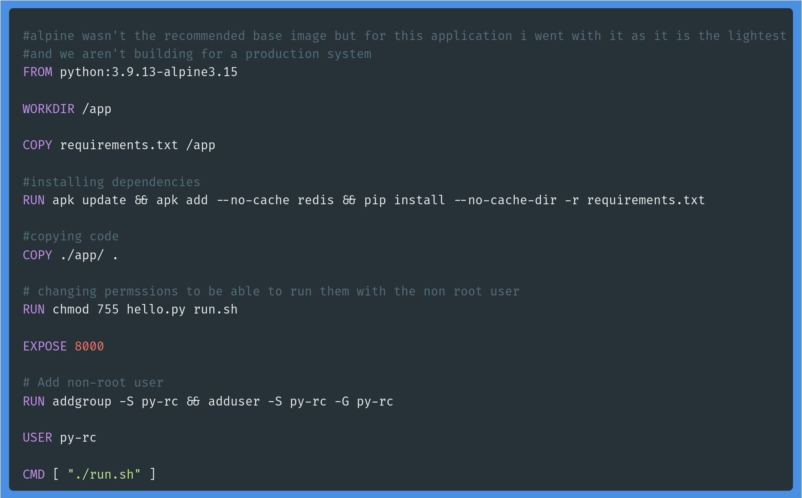
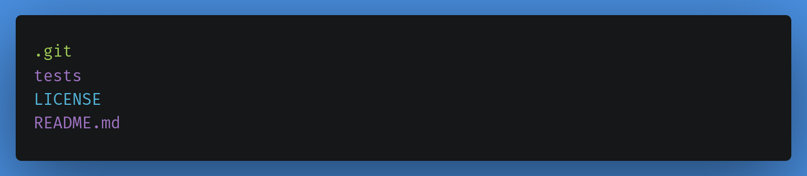
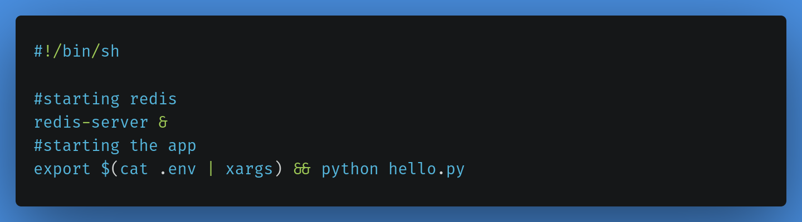

# Python reload counter helm chart

## Description

- A simple reload counter made using tornado the python framework and redis.

## Steps

1. Forked the app code from https://github.com/tradebyte/DevOps-Challenge
2. Created a Dockerfile for the image  

3. Created .dockerignore file to ignore unimportant files from getting containerized  
  
4. Created run.sh the startup script in the docker image  

5. Image repository [Docker hub](https://hub.docker.com/r/alaaamin/reload-count-tornado-py-app)
6. Created Jenkinsfile for jenkins pipeline
7. Made GitHub webhook to trigger the pipeline automatically on new push events  

## Requirments

1. Docker running on a linux os. or if you're using windows or MacOS you need it configured to run linux containers
2. Jenkins if you want to automate building and deployment of the image

## Author

[Alaa A. Amin](https://www.linkedin.com/in/alaaamin-swe/)